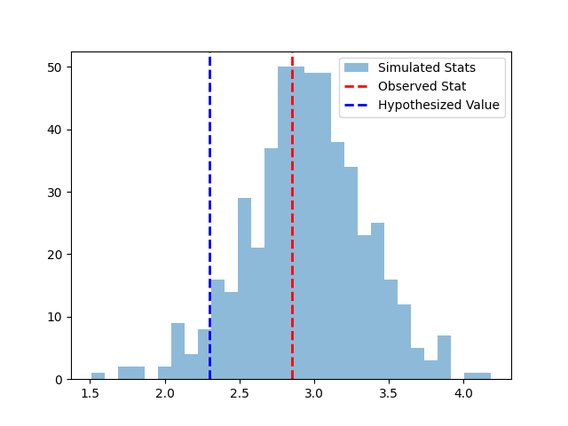
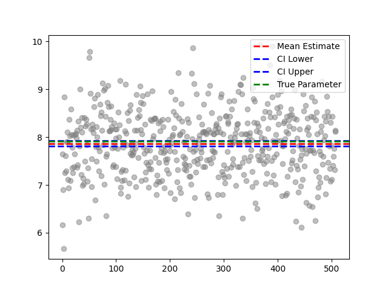

# Assignment Analysis and Explanation

## 1. New Additions to the Webpage

This assignment extends the previous assignment work by adding functionalities for **hypothesis testing** and **confidence intervals**. Here’s a breakdown of the new features:

### Data Generation Inputs
In addition to previous inputs, users can now specify:
- **Intercept (β₀)** and **Slope (β₁)** of the regression line.

These values are used in data generation, following the formula:

$$
Y = \beta_0 + \beta_1 \cdot X + \mu + \text{error}
$$

### Hypothesis Testing Section
Users can perform hypothesis tests on the slope or intercept of the regression line after data generation. Options include:
- **Parameter to Test**: Choose either Slope or Intercept.
- **Type of Test**: Choose between Greater than (`>`), Less than (`<`), or Not equal to (`≠`).

The application calculates a **p-value** for the hypothesis test, displaying whether the observed slope or intercept is statistically significant based on the user’s input.

### Confidence Interval Section
Users can calculate confidence intervals for the slope or intercept after data generation. Options include:
- **Parameter for Confidence Interval**: Choose either Slope or Intercept.
- **Confidence Level**: Select from 90%, 95%, or 99%.

The application calculates the confidence interval using the simulated slopes and intercepts, providing insight into the range within which the true parameter is likely to fall with the selected confidence level.

## 2. Demonstration with Different Inputs

[Watch the demonstration video here](https://youtu.be/Ke_CO2eMqsE)

Attached the video on my website too. 

## 3. Interpreting the p-values

### Case 1 - Hypothesis Test on Slope
Let’s assume the hypothesis test was performed with a null hypothesis that the slope is equal to a hypothesized value, say 4.0 (H₀: β₁ = 4.0), while the observed slope is around 4.6 as specified in the input.

- **Observed Stat**: The observed slope (calculated from the sample data) is approximately 4.6, represented by the red dashed line.
- **Hypothesized Value**: The hypothesized slope value is 4.0, indicated by the blue dashed line.
- **p-value**: Calculated based on the proportion of simulated slopes that are as extreme as or more extreme than the observed slope (4.6), under the null hypothesis that the slope is 4.0.

### Interpretation
- If the p-value is **small** (e.g., < 0.05), it suggests that the observed slope of 4.6 is significantly different from the hypothesized slope of 4.0, leading us to reject the null hypothesis. This would indicate strong evidence that the true slope is greater than 4.0.
- If the p-value is **large** (e.g., > 0.05), we fail to reject the null hypothesis, meaning the observed slope (4.6) is not significantly different from 4.0, implying that the observed difference could reasonably be due to random sampling variability.

Based on the histogram, if the observed slope is farther to the right of the hypothesized slope, we would expect a low p-value, suggesting statistical significance in the observed slope's deviation from the hypothesized value.

## 4. Constructing Confidence Intervals and Their Significance

### Confidence Interval
The confidence interval plot is centered on the slope parameter, displaying individual simulated slope estimates as gray points. Key elements include:

- **Mean Estimate**: The red dashed line marks the average slope from the simulations, giving a central value around which the CI is constructed.
- **Confidence Interval (CI)**: The blue dashed lines represent the upper and lower bounds of the confidence interval for the slope, based on the selected confidence level.
- **True Parameter (Hypothesized Slope)**: The green dashed line represents the specified slope.

### Interpretation of the Confidence Interval for Case 1
- The confidence interval offers a range in which the true slope parameter is likely to fall with a certain level of confidence (95%).
- If the green line (true slope) is within the CI bounds, it indicates that our observed slope estimate (4.6) is consistent with the true slope, reinforcing confidence in the accuracy of the observed estimate.
- If the green line falls outside the CI bounds, it suggests that the observed slope may not reflect the true slope accurately, potentially due to sampling variability or other factors.

### Significance of the CI
- A narrower interval indicates a more precise estimate of the slope, achieved with larger sample sizes or lower variance. Here, with N = 92 and variance σ² = 4.78, the interval should be relatively narrow.
- The confidence interval gives a visual indication of whether our slope estimate (mean) is consistent with the true slope, based on the extent of variability across simulations.

